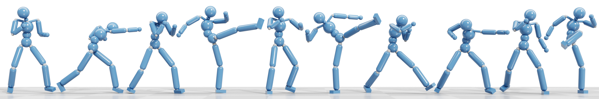

# Interactive Control Generative Adversarial Network
This code repo is to support the paper _**A GAN-Like Approach for Physics-Based Imitation Learning and Interactive Control**_.
[[arXiv](https://arxiv.org/abs/2105.10066)]
[[Youtube](https://www.youtube.com/watch?v=VHMyvDD3B_o)]

This paper has been accepted by *Proceedings of the 20th ACM SIGGRAPH/Eurographics Symposium on Computer Animation* (SCA 2021), and published at *Proceedings of the ACM on Computer Graphics and Interactive Techniques*, Volume 4, Issue 3 with cover image.

_**Abstract**_ --We present a simple and intuitive approach for interactive control of physically simulated characters. Our work builds upon generative adversarial networks (GAN) and reinforcement learning, and introduces an imitation learning framework where an ensemble of classifiers and an imitation policy are trained in tandem given pre-processed reference clips. The classifiers are trained to discriminate the reference motion from the motion generated by the imitation policy, while the policy is rewarded for fooling the discriminators. Using our GAN-like approach, multiple motor control policies can be trained separately to imitate different behaviors. In runtime, our system can respond to external control signal provided by the user and interactively switch between different policies. Compared to existing method, our proposed approach has the following attractive properties: 1) achieves state-of-the-art imitation performance without manually designing and fine tuning a reward function; 2) directly controls the character without having to track any target reference pose explicitly or implicitly through a phase state; and  3) supports interactive policy switching without requiring any motion generation or motion matching mechanism. We highlight the applicability of our approach in a range of imitation and interactive control tasks, while also demonstrating its ability to withstand external perturbations as well as to recover balance. Overall, our approach has low runtime cost and can be easily integrated into interactive applications and games.

## Dependencies

- Pytorch 1.8
- Numba 0.52
- Matplotlib 3.3.4
- PyBullet 3.0.8

We recommend to install all the requirements through Conda by

    $ conda create --name <env> --file requirements.txt -c pytorch -c conda-forge

and using our modified PyBullet by

    $ pip install -e ./bullet3

We modify the Stable PD Controller implementation of Bullet3 regarding force clamp for spherical joints (Line 7310-7347 of `examples/SharedMemory/PhysicsServerCommandProcessor.cpp`).

## Code Usage

To train a policy distributedly by running 8 workers:

    $ python iccgan.py <motion> --rank 0
    $ python iccgan.py <motion> --rank 1
    $ python iccgan.py <motion> --rank 2
    $ python iccgan.py <motion> --rank 3
    $ python iccgan.py <motion> --rank 4
    $ python iccgan.py <motion> --rank 5
    $ python iccgan.py <motion> --rank 6
    $ python iccgan.py <motion> --rank 7

To visualize a trained policy by running:

    $ python iccgan.py <motion> --test

See `envs/data/motions` for supported motions in the name of `<motion>.json`.

## Citation
    @article{10.1145/3480148,
        author = {Xu, Pei and Karamouzas, Ioannis},
        title = {A GAN-Like Approach for Physics-Based Imitation Learning and Interactive Control},
        year = {2021},
        issue_date = {September 2021},
        publisher = {Association for Computing Machinery},
        address = {New York, NY, USA},
        volume = {4},
        number = {3},
        url = {https://doi.org/10.1145/3480148},
        doi = {10.1145/3480148},
        journal = {Proc. ACM Comput. Graph. Interact. Tech.},
        month = sep,
        articleno = {44},
        numpages = {22},
        keywords = {physics-based control, character animation, reinforcement learning, GAN}
    }
